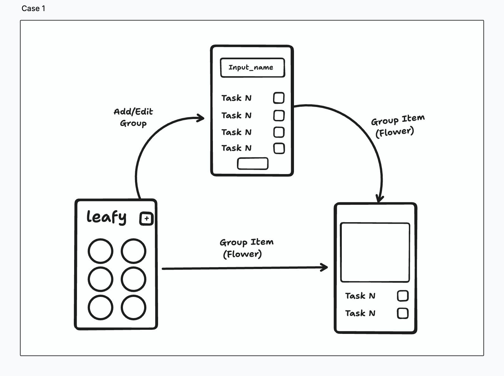

# 🌿 Leafy - Cultivate Productivity Naturally  

## 🌱 Concept and Inspiration  

Leafy was born from a meaningful conversation I had with my wife about life's challenges. We discussed how some challenges can seem overwhelming at first, but if we tackle them gradually, step by step, they eventually transform into achievements.  

Just like nurturing a flower, each small action towards solving a problem brings us closer to seeing the beautiful results. Neglecting challenges, on the other hand, is akin to abandoning a flower, eventually causing it to wither. Inspired by this metaphor, Leafy provides users with a unique and rewarding approach to managing their daily tasks and challenges.  

## 🌸 How Leafy Works  

Leafy presents productivity in a playful and visual way, turning your goals and tasks into a blooming garden:

- **Garden (Home Screen)**:  
  All your active challenges appear as flowers in a virtual garden. The garden grows as you create and complete challenges.

- **Challenges as Flowers**:  
  Each challenge you plant in your garden is represented by a flower. Completing tasks associated with the challenge makes the flower gradually bloom into its most beautiful state.

- **Tasks as Growth Stages**:  
  Individual tasks represent stages in the growth of your flower. As tasks get marked as complete, the flower visually evolves, reflecting your progress and achievements.

## 🖥️ First APP Screen Flow  

Below is the initial screen flow that illustrates the core idea behind Leafy:

## 🚀 MVP Scope  

For this first MVP iteration, the following core functionalities were implemented:

- **Home Screen (Garden)** – View all active challenges visually represented by different stages of blooming plants.
- **Challenge Creation Screen** – Create custom challenges and manually add tasks.
- **AI-Powered Task Generation** – Generate relevant tasks automatically using OpenAI integration based on the challenge title.
- **Challenge Detail Screen** – Mark tasks as complete and watch your plant grow visually.
- **Challenge Edit Screen** – Easily modify challenge titles or tasks.
- **Deletion Confirmation** – Simple and intuitive alerts to confirm deletions.

## 🔮 Future Enhancements

Check out our [Future Enhancements](FUTURE.md) document for planned features and improvements.
