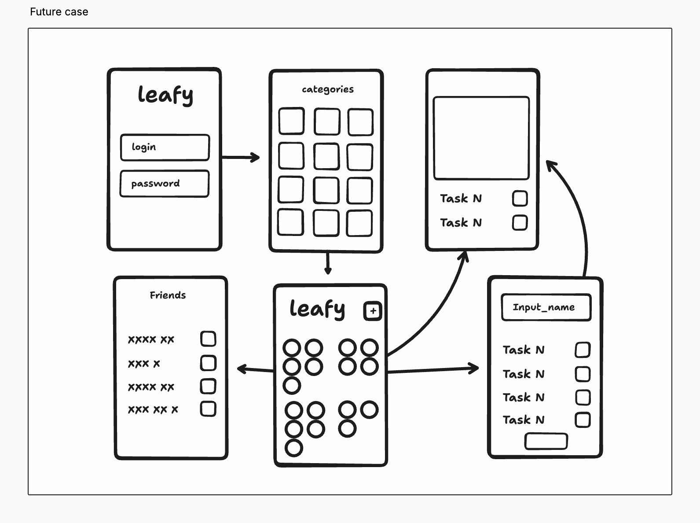

# 🌿 Leafy - Future Roadmap & Improvements

Here's my vision for the next steps and improvements for **Leafy**, building upon this MVP.

---

## 🚀 **Planned Feature Enhancements**

### 👤 **User Profile & Preferences**
- **Personal Configuration Page:**
  - Allow users to select their areas of interest.
  - Gather user preferences to enable personalized garden suggestions.
  - Customize experience based on user profile data.

### 🌷 **Multiple Gardens**
- Enable users to create multiple gardens, each containing numerous challenges.
- Organize gardens by theme or area of interest (e.g., personal, work, hobbies).

### 🎨 **Enhanced Design & Professional UI**
- Refine and polish the existing UI with professional design.
- Elevate visual aesthetics, making the overall look and feel more professional.

### ✨ **Advanced Animations**
- Improve flower growth animations, creating smoother, more detailed blooming effects.
- Add subtle celebrations or visual rewards when users complete challenges to reinforce positive feedback loops.

### 📅 **Deadlines & Reminders**
- Allow users to set deadlines for challenges or individual tasks.
- Integrate gentle reminders or notifications to keep users engaged and productive.
- If the user doesn't complete the challenge before the deadline, the flower starts to wither and become harder to grow needs more attention.

### 🏅 **Gamification & Social Competition**
- Implement friend lists and leaderboards to encourage friendly competition.
- Users could share their gardens, compare progress, or engage in cooperative challenges.
- Allow users to create groups and challenge their friends to a friendly competition.
- **Points System:**
  - Award points based on challenge complexity and garden themes.
  - Global and friend-based leaderboards.

### 🤖 **Advanced AI & Personalization**
- Provide users with a screen to select areas of interest, allowing AI to generate highly personalized tasks and challenge suggestions based on individual preferences.
- AI-powered evaluation system for challenges and gardens:
  - Analyze challenge complexity and assign appropriate point values.
  - Consider multiple factors like time commitment, skill level, and impact.
  - Dynamic point adjustment based on user performance and feedback.

---

## ⚙️ **Technical Improvements**

### 🔐 **Authentication & User Management**
  - Implement a secure authentication system for users.
  - Enable SSO options for easier onboarding and secure authentication.

### ☁️ **Cloud Infrastructure**
  - Implement cloud database solution for user data storage and synchronization.

### 🧪 **Automated Testing**
- Add unit and widget testing to improve stability.
- Integrate end-to-end (E2E) tests to guarantee reliable user experience.

### 🔄 **Continuous Integration & Automated Releases**
- Integrate CI/CD pipelines (e.g., GitHub Actions) to automate tests, builds, and releases.

---

## 🌱 **Future Screen Flow**

Here is the future screen flow that illustrates the core idea behind Leafy:

