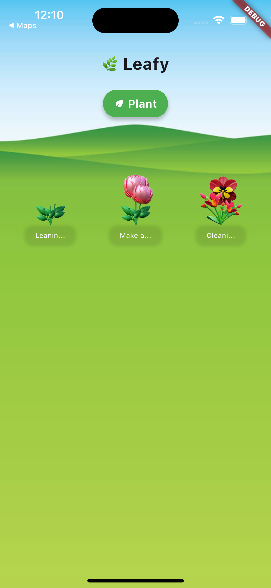
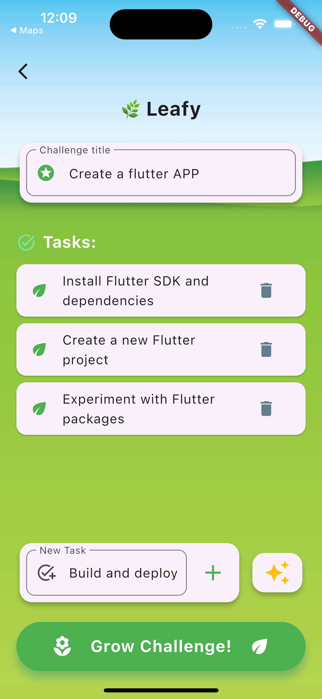
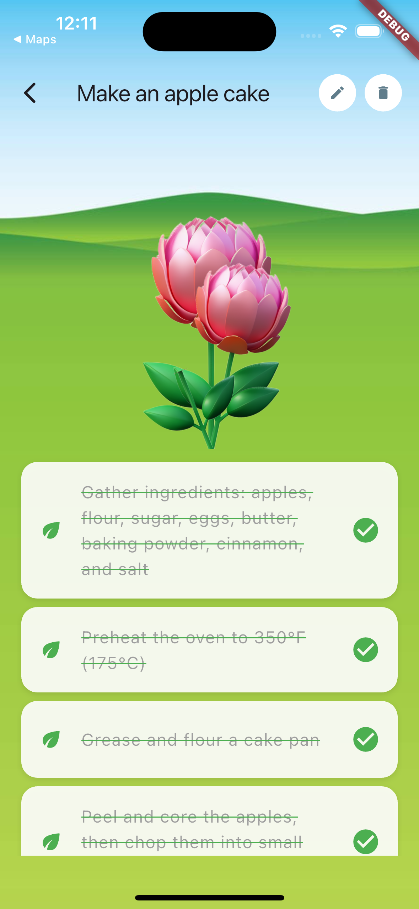
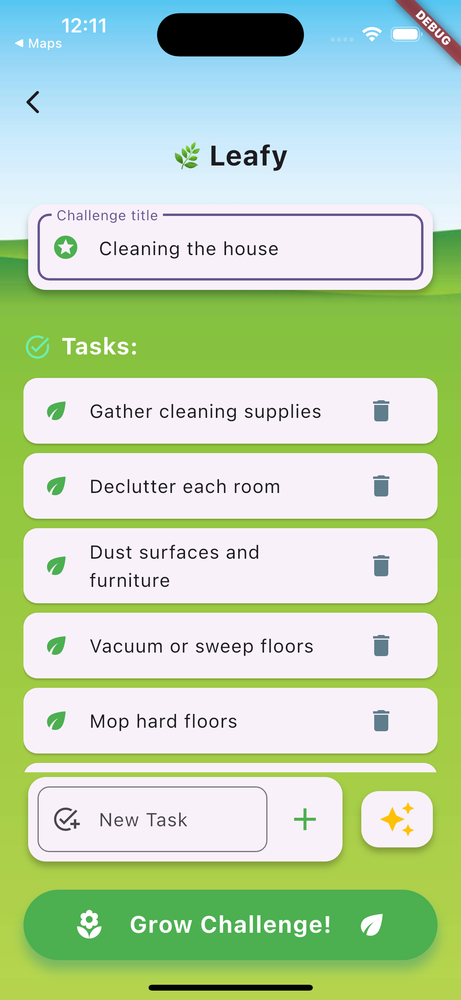
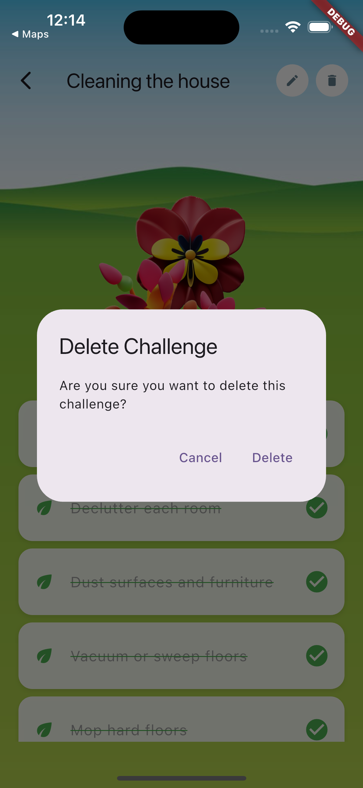

# 🌿 Leafy App - Technical Overview

For a detailed look at the app's concept and features, check out our [concept document](CONCEPT.md).

**Leafy** is a playful and smart to-do app built with Flutter, designed to make productivity visually engaging and enjoyable through gamification and artificial intelligence.

## 📸 Screens

|  |  |  |
|:---:|:---:|:---:|
|  |  |  |

- **Home Screen (Garden)** – View all active challenges visually represented by different stages of blooming plants.
- **Challenge Creation Screen** – Create custom challenges and manually add tasks.
- **AI-Powered Task Generation** – Generate relevant tasks automatically using OpenAI integration based on the challenge title.
- **Challenge Detail Screen** – Mark tasks as complete and watch your plant grow visually.
- **Challenge Edit Screen** – Easily modify challenge titles or tasks.
- **Deletion Confirmation** – Simple and intuitive alerts to confirm deletions.

## 🛠️ Technologies Used

- **Flutter** – Cross-platform app development
- **Provider** – State management
- **Hive** – Local data storage
- **OpenAI API** – Smart task suggestions via AI integration
- **Envied** – Environment variables management

## 🚀 Getting Started

1. Clone the repository
2. Create a `.env` file in the root directory with your OpenAI API key:
   ```
   OPEN_AI_API_KEY=your_api_key_here
   ```
3. Install dependencies:
   ```bash
   flutter pub get
   ```
4. Generate environment config:
   ```bash
   flutter pub run build_runner build
   ```
5. Run the app:
   ```bash
   flutter run
   ```

## ⚙️ Project Structure

The project follows a clean and modular architecture:

```
lib/
├── env/           # Environment configuration
├── models/        # Data models and entities
├── repositories/  # Data access and business logic
├── screens/       # App screens and UI layouts
├── services/      # External services integration (OpenAI)
├── ui/           # Reusable UI components
├── utils/        # Helper functions and utilities
└── main.dart     # App entry point and configuration
```


## 🔮 Future Enhancements

Check out our [Future Enhancements](FUTURE.md) document for planned features and improvements.


